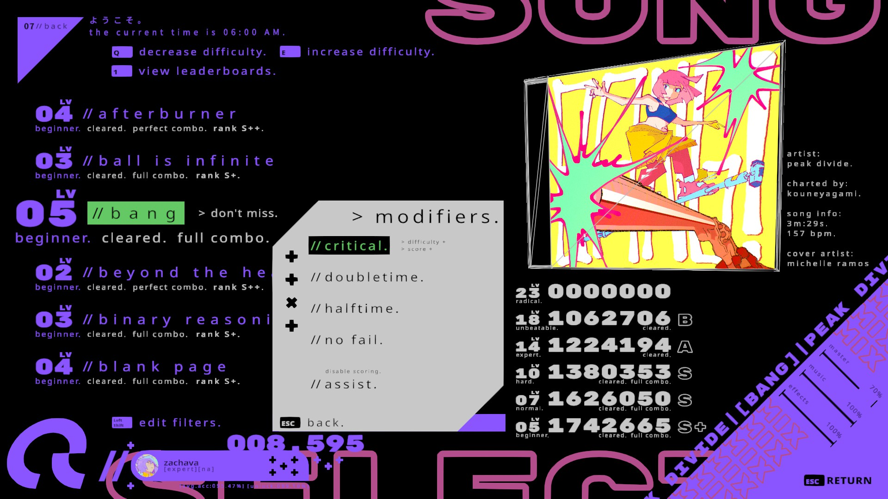

# Custom Characters

This mod for UNBEATABLE allows you to add custom arcade mode palettes.

Please note that this mod is unofficial and not endorsed by D-CELL GAMES in any way.

## Compatible game versions

- UNBEATABLE (tested with `v1.7.3`)

## Requirements

- [BepInEx](https://github.com/BepInEx/BepInEx)

## Installation

1. Download and install BepInEx into your game directory (if you use [CustomBeatmaps](https://github.com/unbeatable-modding/CustomBeatmapsV5), you have this installed already)
2. Run the game, then close it
3. [Download this mod](https://github.com/Zachava96/CustomPalettes/releases)
4. Merge the BepInEx folder from this mod with the BepInEx folder in your game directory
5. (Optional) Add additional palettes into your `UNBEATABLE/BepInEx/plugins/CustomPalettes` folder.
5. Run the game

## How do I make my own custom palettes?

Currently, palettes are composed of a name and five colors:

0. Main foreground color (purple in example)
1. Main background color (black in example)
2. Decoration color (pink in example)
3. Secondary text color (light grey in example)
4. Selection color (green in example)

Palettes also have 5 additional colors set, but they appear to be unused and are set to clear (0,0,0,0) for all known palettes.

Each color has an R, G, B and A value out of 255.

See the example palette in `UNBEATABLE/BepInEx/plugins/CustomPalettes` for structure.